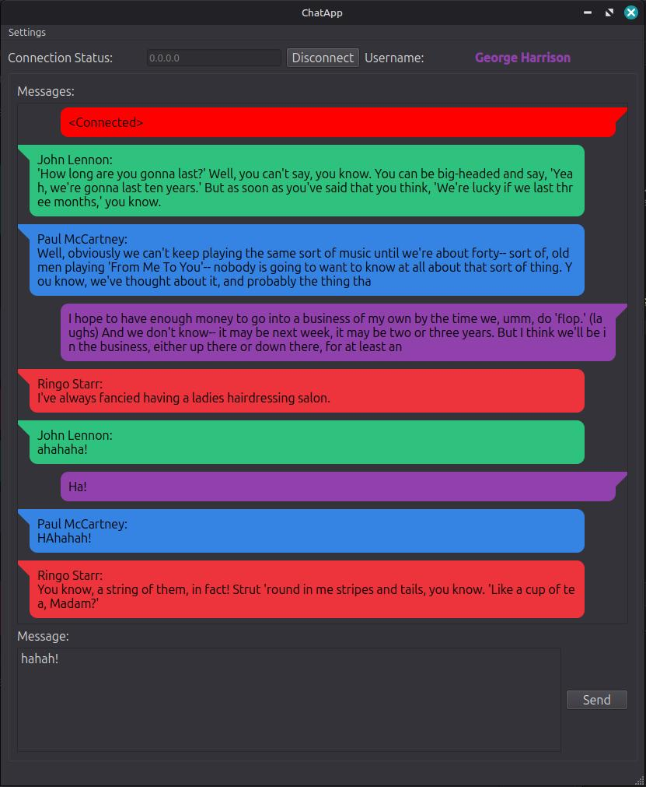
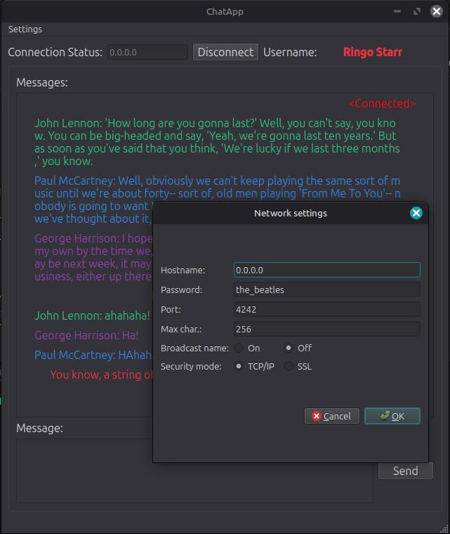
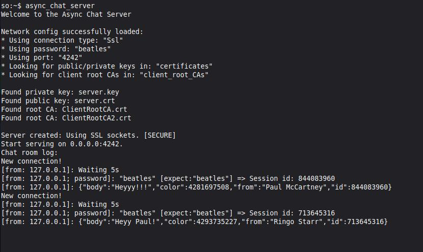

# Async TCP / TLS Chat Application Using Qt6 & Boost::asio 

TCP/TLS1 Chat Messenger Client using Qt6, and async TCP/TLS server using boost.asio.

1: Transmission Control Protocol/Transport Layer Security (formally known as Secure Socket Layer)

## Qt6 TCP/TLS Client 

App features:

* Choose between "more modern" speech bubble or "old school" irc-chat-style text
* Connection modes (TCP vs TLS) & network settings set at runtime
* Network Settings saved/loaded from config file (`chat_app_client_config.json`) file 
* Compatible with the [Raspberry Pi Pico 2W bare metal TCP chat server](https://github.com/so-groenen/pi_pico2_w_chat_server)

 

Behind the curtains:
* Uses Model-View-Presenter (MVP) architecture with C++20/23 features.
* Text messages get formatted to json, containing relevant fields: username, user session id, message and font color. The server's role is to broadcast the messages to all connected users
* TCP client with optional TLS layer on top

## Asynchronous Boost.asio TCP/TLS server

* Asyncronous server handling multiple clients concurrently 
* Uses c++20 coroutines (asio's *awaitable* / *co_await* syntax, reminiscent of Python's *async*/*await* syntax)
* Automatically loads all client/server certificates in folder given in config file
* Server's network settings (TCP vs SSL, *path/to/certificates* etc) configured using json file (`chat_app_server_config.json`)